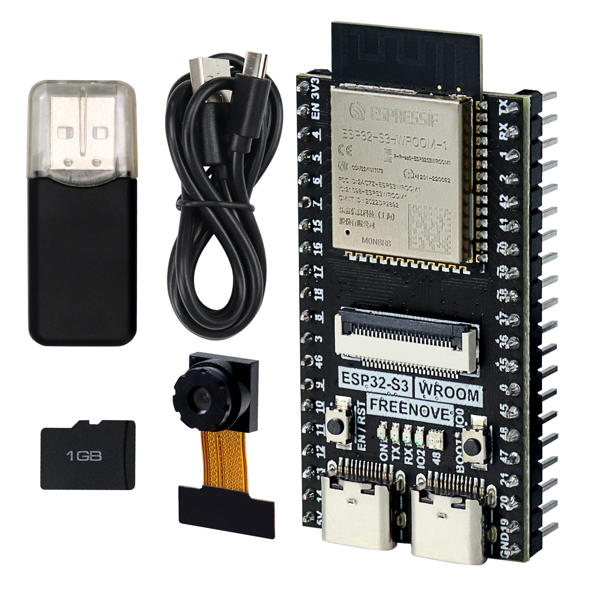

## ESP32_S3_WROOM_Board 이용하가 카메라, SD카드 사용해보기

- Freenove® ESP32-S3 유사보드(거의 동일) 이용

- 카메라 연결, 핀맵 동일하게 설정하고 SD카드에 촬영한 사진 저장 기능 수행

- 웹서버 수행하게 하고 외부에서 웹페이지 통해서 카메라 영상 스트리밍 기능 수행

- 웹서버 수행하게 하고 외부에서 웹페이지 통해서 사진촬용, 사진목록 보여주기, 사진내용 보기

- SD카드에 저장해 놓은 사진들 삭제하는 기능 수행

- secrets.h 파일에 ssid, password 넣고 빌드하면 됨.

ESP32-S3 chip is manufactured by Espressif®.

> Espressif® is a trademark of Espressif Systems (Shanghai) Co.Ltd (https://www.espressif.com/).

Freenove ESP32-S3 Board can be uploaded code using Arduino® IDE.

> Arduino® is a trademark of Arduino LLC (https://www.arduino.cc/).

### Download

Click the green "Code" button, then click "Download ZIP" button in the pop-up window.  
Do NOT click the "Open in Desktop" button, it will lead you to install Github software.

> If you meet any difficulties, please contact our technical team for help.

### Use

1. Download the ZIP file as above.
2. Unzip it and you will get a folder contains tutorials and related files.
3. Please start with "Start Here.pdf".

### Support

Freenove provides free and quick customer support. Including but not limited to:

- Quality problems of products
- Problems of products when used
- Questions of learning and creation
- Opinions and suggestions
- Ideas and thoughts

Please send an email to:

[support@freenove.com](mailto:support@freenove.com)

We will reply within one working day.

### Purchase

Please visit the following page to purchase our products:

http://freenove.com/store

Business customers please contact us through the following email address:

[sale@freenove.com](mailto:sale@freenove.com)

### About

Freenove provides open source electronic products and services.

Freenove is committed to helping customers learn programming and electronic knowledge, quickly implement product prototypes, realize their creativity and launch innovative products. Our services include:

- Kits for learning programming and electronics
- Kits compatible with Arduino®, Raspberry Pi®, micro:bit®, etc.
- Kits for robots, smart cars, drones, etc.
- Components, modules and tools
- Design and customization

To learn more about us or get our latest information, please visit our website:

http://www.freenove.com

### Copyright

All the files in this repository are released under [Creative Commons Attribution-NonCommercial-ShareAlike 3.0 Unported License](http://creativecommons.org/licenses/by-nc-sa/3.0/).
You can find a copy of the license in this repository.

> It means you can use these files on your own derived works, in part or completely. But not for commercial use.

Freenove® brand and logo are trademarks of Freenove Creative Technology Co., Ltd. Must not be used without permission.

Other registered trademarks and their owners appearing in this repository:

Arduino® is a trademark of Arduino LLC (https://www.arduino.cc/).  
Raspberry Pi® is a trademark of Raspberry Pi Foundation (https://www.raspberrypi.org/).  
micro:bit® is a trademark of Micro:bit Educational Foundation (https://www.microbit.org/).  
Espressif® is a trademark of Espressif Systems (Shanghai) Co.Ltd (https://www.espressif.com/).
